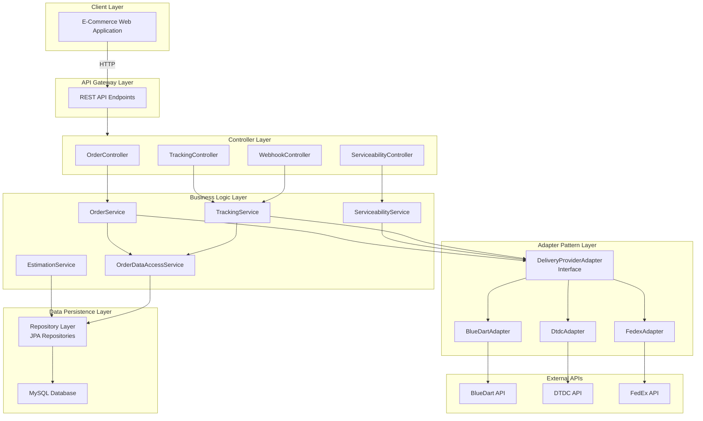
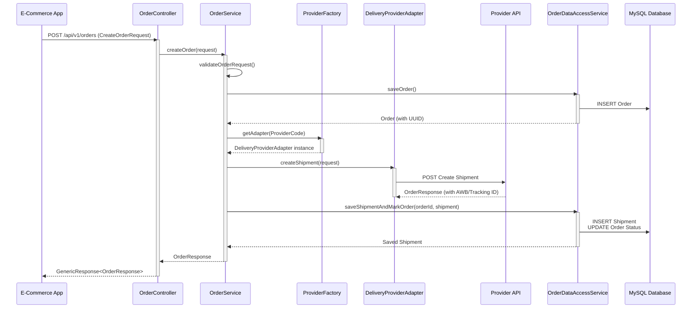
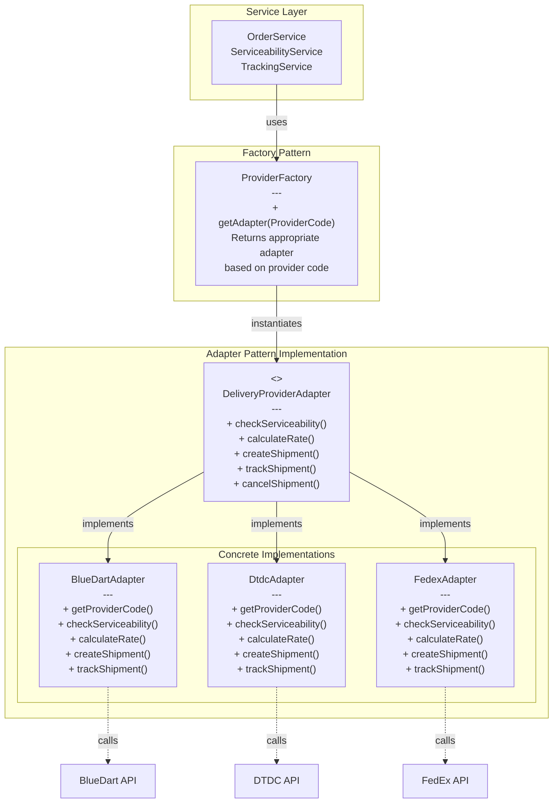
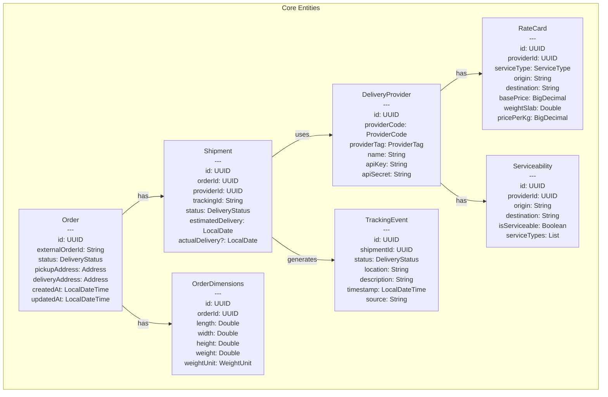
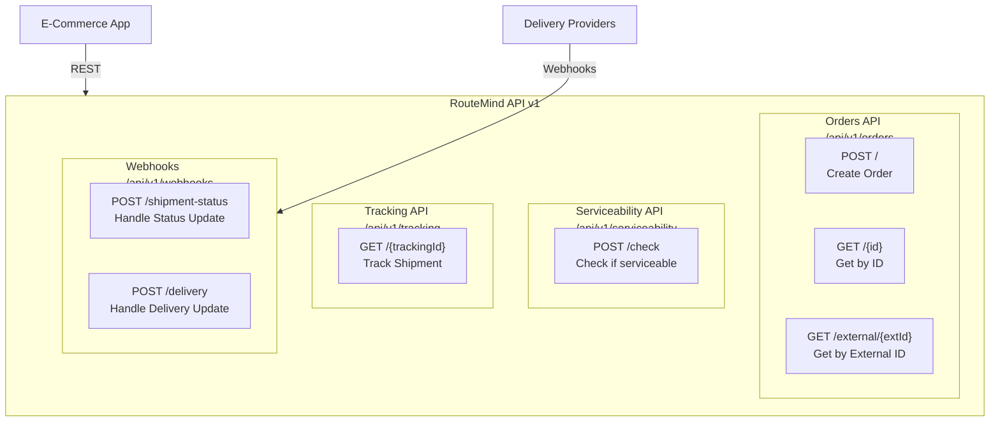
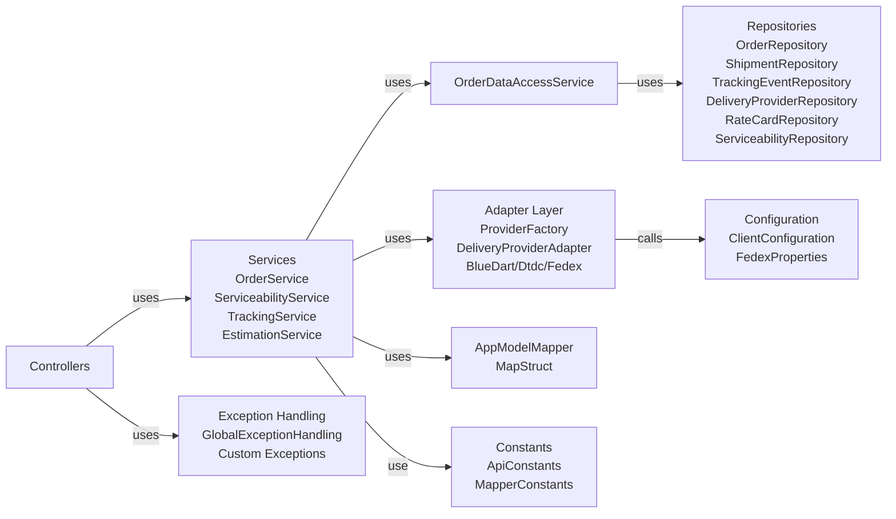
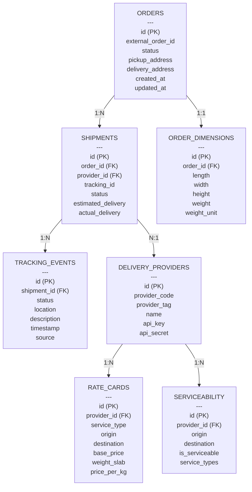
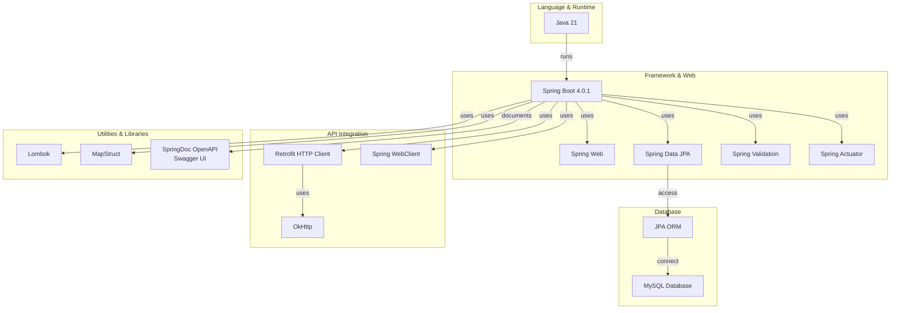

# RouteMind System Architecture

This document contains comprehensive Mermaid diagrams for the RouteMind system architecture.

## 1. High-Level System Architecture

## 2. Request Processing Flow - Order Creation

## 3. Adapter Pattern - Multi-Provider Support

## 4. Data Model - Entity Relationships

## 5. API Endpoints Overview

## 6. Component Dependencies

## 7. Database Schema Overview

## 8. Technology Stack

## Architecture Patterns Used

### 1. **Adapter Pattern**
- Allows integration with multiple delivery providers (BlueDart, DTDC, FedEx)
- Each provider has its own adapter implementation
- Services interact with adapters through a common interface

### 2. **Factory Pattern**
- `ProviderFactory` creates appropriate adapter instances based on provider code
- Decouples service layer from concrete adapter implementations

### 3. **Repository Pattern**
- Data access through Spring Data JPA repositories
- Abstracts database operations
- All repositories extend JpaRepository interface

### 4. **Data Transfer Object (DTO) Pattern**
- Separate request and response DTOs
- Cleaner API contracts
- Decouples internal entities from external APIs

### 5. **Service Layer Pattern**
- Business logic centralized in service classes
- Transaction management
- Orchestrates use of adapters and repositories

### 6. **Configuration Externalization**
- Properties-based configuration
- Environment-specific settings via properties files

## Key Features

- **Multi-Provider Support**: Seamless integration with multiple delivery providers
- **Event-Driven Architecture**: Webhook support for real-time updates
- **RESTful API**: Well-structured REST endpoints
- **Type Safety**: MapStruct for compile-time object mapping
- **Comprehensive Error Handling**: Global exception handler with custom exceptions
- **API Documentation**: Swagger/OpenAPI for easy exploration
- **Transaction Management**: Proper ACID compliance with Spring transactions
- **Scalability**: Stateless service design suitable for horizontal scaling
