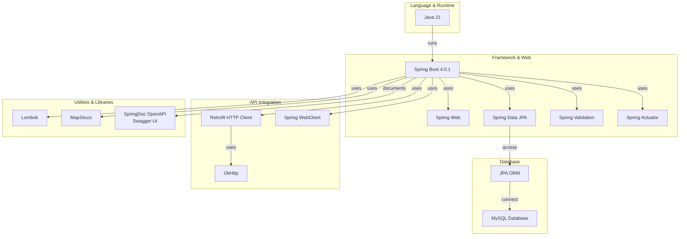
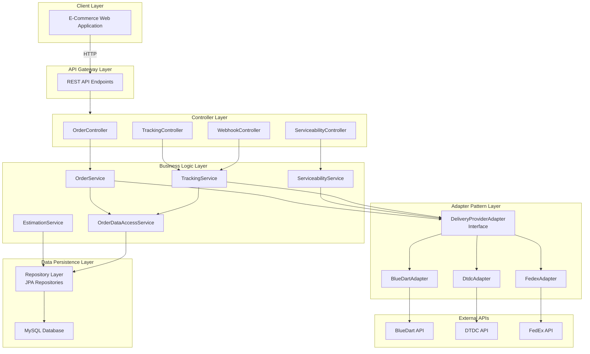
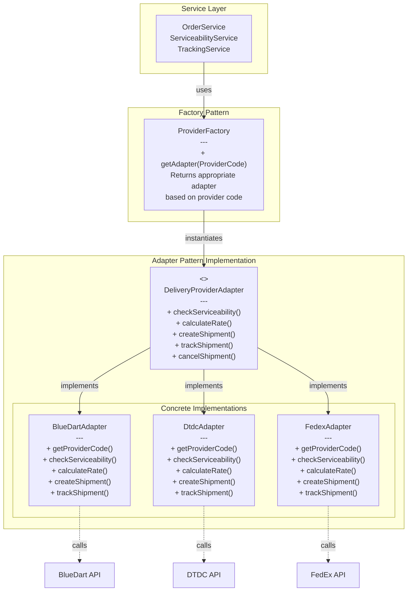
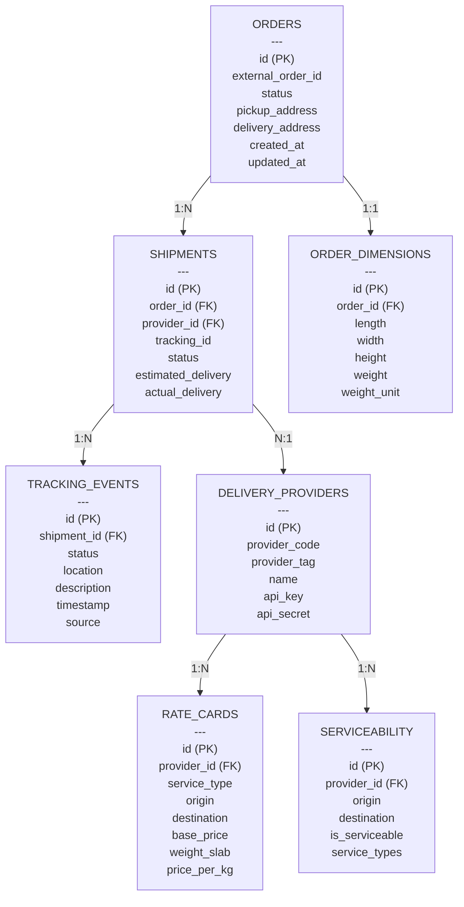
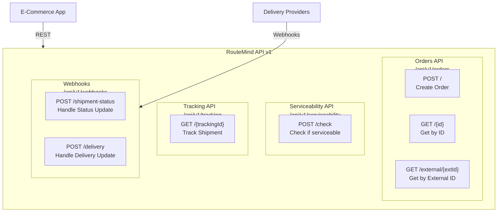

# 🚚 RouteMind

## Overview

RouteMind is an intermediate delivery integration microservice designed for e-commerce web applications. It provides a unified API to interact with multiple delivery providers (BlueDart, DTDC, FedEx), enabling seamless order creation, tracking, serviceability checks, and cost estimation. This service acts as a middleware layer, abstracting the complexities of different provider APIs and offering a consistent interface for e-commerce platforms.

As a computer science graduate seeking an internship, this project demonstrates proficiency in Java, Spring Boot, microservices architecture, API integration, database management, and software design patterns.

## ✨ Features

### Core Functionality
- **📦 Order Management**: Create and retrieve orders with external order IDs for integration with e-commerce platforms.
- **📍 Shipment Tracking**: Real-time tracking of shipments across multiple providers with historical event logging.
- **🔍 Serviceability Checks**: Verify if delivery is possible between pickup and delivery locations, providing available options.
- **💰 Cost Estimation**: Calculate shipping costs based on weight, distance, service type, and COD charges using provider rate cards.
- **🏢 Multi-Provider Support**: Integrated adapters for BlueDart, DTDC, and FedEx with extensible architecture for additional providers.
- **🔗 Webhook Integration**: Receive real-time status updates from providers via webhooks and update internal tracking events.

### Technical Features
- **🌐 RESTful API**: Well-structured REST endpoints with consistent response formats.
- **📚 API Documentation**: Swagger/OpenAPI documentation for easy API exploration and testing.
- **🗄️ Database Integration**: JPA-based persistence with MySQL for orders, shipments, tracking events, and rate cards.
- **🔄 Object Mapping**: MapStruct for type-safe and performant object-to-object mapping.
- **🛡️ Error Handling**: Comprehensive exception handling with custom error responses.
- **📝 Logging**: Structured logging throughout the application for debugging and monitoring.
- **✅ Validation**: Input validation using Bean Validation annotations.
- **🔄 Transaction Management**: Proper transaction handling for data consistency.

## 🛠️ Tech Stack

- **☕ Language**: Java 21
- **🌱 Framework**: Spring Boot 4.0.1
- **🗄️ Database**: MySQL
- **🔨 Build Tool**: Maven
- **📖 Documentation**: SpringDoc OpenAPI (Swagger)
- **🔄 Object Mapping**: MapStruct
- **🌐 HTTP Client**: Retrofit with OkHttp
- **⚛️ Reactive Programming**: Spring WebFlux (WebClient)
- **📚 Other Libraries**:
  - Lombok (for reducing boilerplate code)
  - Spring Boot Starter Web (for REST APIs)
  - Spring Boot Starter Data JPA (for database operations)
  - Spring Boot Starter Validation (for input validation)
  - Spring Boot Starter Actuator (for monitoring and health checks)

### Technology Stack Diagram



## Project Structure

```
src/
├── main/
│   ├── java/
│   │   └── com/example/RouteMind/
│   │       ├── RouteMindApplication.java          # Main Spring Boot application class
│   │       ├── adapter/                           # Adapter pattern for provider integrations
│   │       │   ├── DeliveryProviderAdapter.java  # Interface for provider adapters
│   │       │   └── implementation/                # Concrete adapter implementations
│   │       │       ├── BlueDartAdapter.java
│   │       │       ├── DtdcAdapter.java
│   │       │       └── FedexAdapter.java
│   │       ├── client/                            # External API clients
│   │       │   └── fedex/
│   │       │       ├── FedexApiClient.java       # Retrofit-based FedEx API client
│   │       │       └── dto/                       # Data transfer objects for FedEx API
│   │       ├── config/                            # Configuration classes
│   │       │   ├── ClientConfiguration.java
│   │       │   └── FedexProperties.java
│   │       ├── constants/                         # Application constants
│   │       │   ├── ApiConstants.java
│   │       │   └── MapperConstants.java
│   │       ├── controller/                        # REST controllers
│   │       │   ├── OrderController.java
│   │       │   ├── ServiceabilityController.java
│   │       │   ├── TrackingController.java
│   │       │   └── WebhookController.java
│   │       ├── dto/                               # Data transfer objects
│   │       │   ├── Request/                       # Request DTOs
│   │       │   └── Response/                      # Response DTOs
│   │       ├── entity/                            # JPA entities
│   │       │   ├── DeliveryProvider.java
│   │       │   ├── Order.java
│   │       │   ├── OrderDimensions.java
│   │       │   ├── RateCard.java
│   │       │   ├── Serviceability.java
│   │       │   ├── Shipment.java
│   │       │   └── TrackingEvent.java
│   │       ├── enums/                             # Enumeration classes
│   │       │   ├── DeliveryStatus.java
│   │       │   ├── PaymentMode.java
│   │       │   ├── ProductCategory.java
│   │       │   ├── ProviderCode.java
│   │       │   ├── ProviderTag.java
│   │       │   ├── ServiceType.java
│   │       │   ├── TransportMode.java
│   │       │   └── WeightUnit.java
│   │       ├── exception/                         # Custom exceptions
│   │       │   ├── GlobalExceptionHandling.java
│   │       │   ├── OrderNotFoundException.java
│   │       │   ├── ProviderException.java
│   │       │   └── RouteMindException.java
│   │       ├── factory/                           # Factory pattern for adapters
│   │       │   └── ProviderFactory.java
│   │       ├── mapper/                            # Object mapping utilities using MapStruct
│   │       │   └── AppModelMapper.java
│   │       ├── repository/                        # JPA repositories
│   │       │   ├── DeliveryProviderRepository.java
│   │       │   ├── OrderRepository.java
│   │       │   ├── RateCardRepository.java
│   │       │   ├── ServiceabilityRepository.java
│   │       │   ├── ShipmentRepository.java
│   │       │   └── TrackingEventRepository.java
│   │       └── service/                           # Business logic services
│   │           ├── EstimationService.java
│   │           ├── OrderDataAccessService.java
│   │           ├── OrderService.java
│   │           ├── ServiceabilityService.java
│   │           └── TrackingService.java
│   └── resources/
│       └── application.yml                        # Application configuration
└── test/
    └── java/
        └── com/example/RouteMind/
            └── RouteMindApplicationTests.java     # Basic test class
```

## Architecture

RouteMind follows a layered architecture with clear separation of concerns:

1. **Controller Layer**: Handles HTTP requests and responses, delegates to services.
2. **Service Layer**: Contains business logic, orchestrates operations across multiple components.
3. **Repository Layer**: Manages data persistence using Spring Data JPA.
4. **Adapter Layer**: Implements the Adapter pattern for integrating with different delivery providers.
5. **Client Layer**: Contains HTTP clients for external API integrations (e.g., FedEx API).

### Design Patterns Used
- **Adapter Pattern**: For provider-specific integrations
- **Factory Pattern**: For creating provider adapters dynamically
- **Repository Pattern**: For data access abstraction
- **DTO Pattern**: For data transfer between layers
- **Builder Pattern**: For constructing complex objects

### System Architecture Diagram



### Multi-Provider Adapter Pattern



### Database Schema Diagram



## 🔌 API Endpoints

### Order Management
- `POST /api/v1/orders` - Create a new order
- `GET /api/v1/orders/{id}` - Get order by internal ID
- `GET /api/v1/orders/external/{externalOrderId}` - Get order by external ID

### Tracking
- `GET /api/v1/tracking/{trackingId}` - Track shipment by tracking ID

### Serviceability
- `POST /api/v1/serviceability` - Check delivery serviceability and get options

### Webhooks
- `POST /api/v1/webhooks/bluedart` - Receive BlueDart status updates
- `POST /api/v1/webhooks/delhivery` - Receive Delhivery status updates
- `POST /api/v1/webhooks/dtdc` - Receive DTDC status updates
- `POST /api/v1/webhooks/fedex` - Receive FedEx status updates

### API Endpoints Overview Diagram



## 🚀 Setup and Installation

### Prerequisites
- ☕ Java 21 or higher
- 🔨 Maven 3.6+
- 🗄️ MySQL 8.0+

### Steps
1. **📥 Clone the repository**:
   ```bash
   git clone https://github.com/amanxdeep/route-mind.git
   cd route-mind
   ```

2. **⚙️ Configure the database**:
   - Create a MySQL database named `routemind_db`
   - Update `src/main/resources/application.yml` with your database credentials

3. **🔧 Configure FedEx API** (optional):
   - Obtain FedEx API credentials
   - Update the `fedex` section in `application.yml`

4. **🔨 Build the application**:
   ```bash
   ./mvnw clean compile
   ```
   
   Note: The project uses MapStruct for object mapping, which requires annotation processing during compilation. The Maven compiler plugin is configured to include Lombok and MapStruct processors.

5. **▶️ Run the application**:
   ```bash
   ./mvnw spring-boot:run
   ```

6. **🌐 Access the application**:
   - API Base URL: `http://localhost:8080/route-mind`
   - Swagger Documentation: `http://localhost:8080/route-mind/swagger-ui.html`

## Configuration

Key configuration properties in `application.yml`:

- **Server**: Port 8080, context path `/route-mind`
- **Database**: MySQL connection details
- **JPA**: Hibernate settings with SQL logging
- **FedEx**: API credentials and endpoints

## Database Schema

The application uses the following main entities:
- **Order**: Represents customer orders
- **Shipment**: Links orders to provider shipments
- **TrackingEvent**: Stores tracking history
- **RateCard**: Provider pricing information
- **Serviceability**: Delivery availability by pincode
- **DeliveryProvider**: Provider configuration

## 📊 Monitoring

The application includes Spring Boot Actuator for monitoring:
- Health checks: `/actuator/health`
- Metrics: `/actuator/metrics`
- Info: `/actuator/info`

## 🔮 Future Enhancements

- Complete implementation of BlueDart and DTDC API integrations
- Add more delivery providers
- Implement rate limiting and circuit breakers
- Add comprehensive unit and integration tests
- Implement authentication and authorization
- Add message queuing for better webhook handling
- Implement caching strategies for improved performance

## 🤝 Contributing

This project demonstrates key software engineering concepts suitable for internship applications:
- Clean architecture and separation of concerns
- Design patterns implementation
- RESTful API design
- Database design and ORM usage
- External API integration
- Error handling and logging
- Configuration management

## License

This project is for educational and portfolio purposes.

---

## 👤 Author

**Amandeep Singh**  
Computer Science Graduate | Backend Developer | Microservices Enthusiast

---

## 📞 Support

For questions or issues, please:
- Check the troubleshooting section
- Review application logs
- Create an issue on GitHub

---

**Last Updated:** April 2026  
**Current Version:** 0.0.1-SNAPSHOT